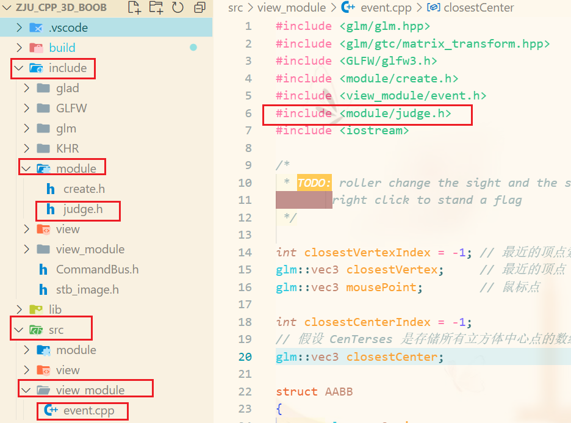
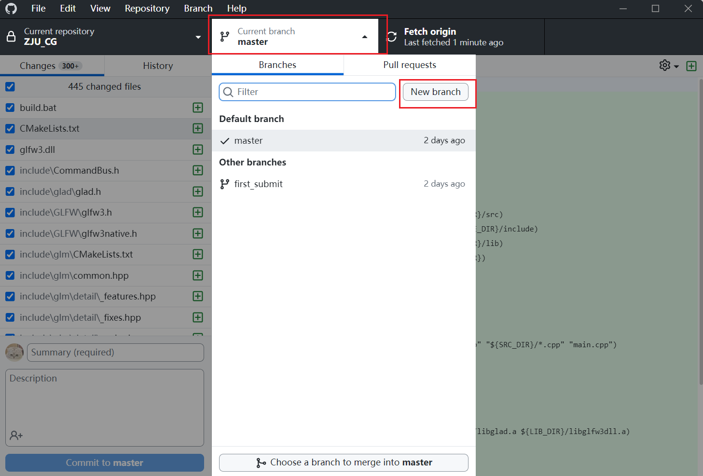
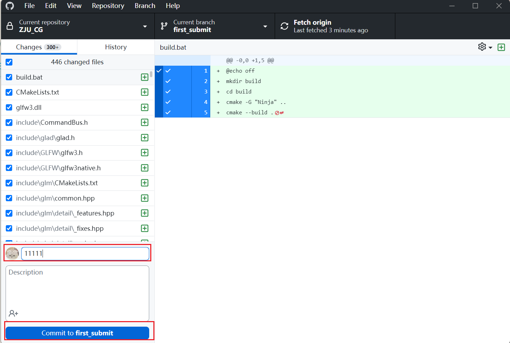
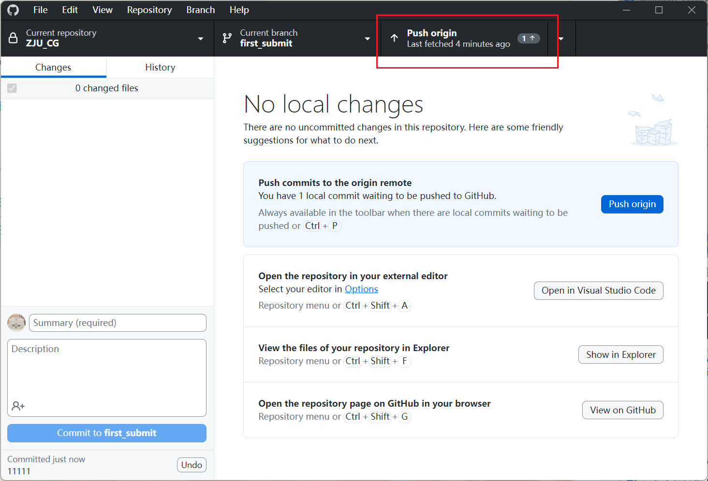
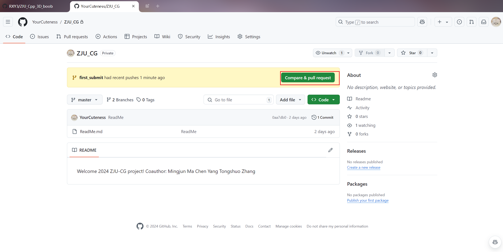
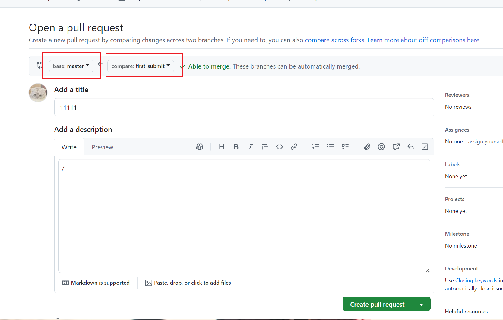
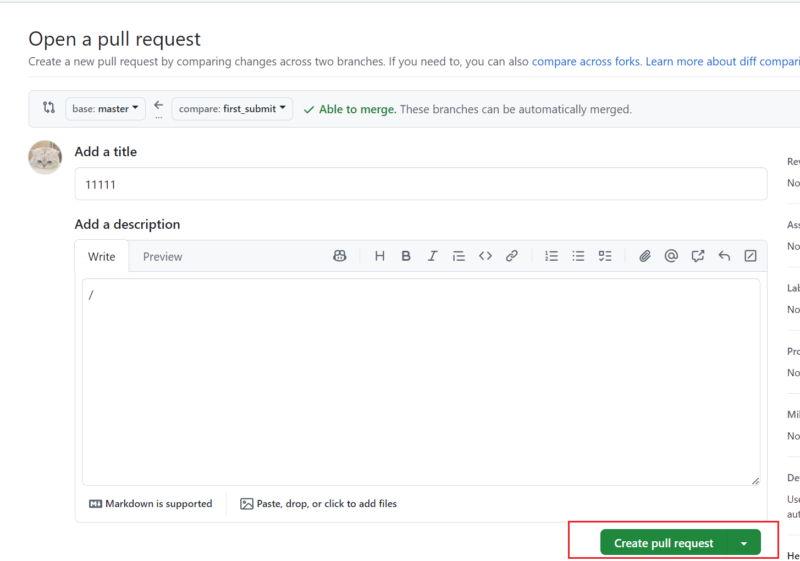

# 本页面用于开发者规范书写

以Q & A形式进行，可以补充

## 1.如何创建新文件夹/新文件

 - 当开发者需要在src中创建`新的文件/文件夹`时，必须在include中创建新的`对应名称文件/文件夹`，便于其他开发者调用你的函数。

## 2.如何调用include里面的库？

 -  在你自己的cpp中，假想此时路径在include文件夹，然后在你自己的文件头使用相对路径即可，这里举例`src/view_module/event.cpp`引用`include/module/judge.h`的情况

## 3.如何提交代码

 - 使用Github Desktop，打开当前项目
 - 先点击Fetch origin同步远端代码，以防远端代码与本地有冲突（若有冲突，则在本地修改到没有冲突再继续下一步）
 - 点击Current branch，新建一个分支
&emsp;
    
&emsp;
 - 接着在summery填写好这次提交的标题,然后点击下方Commit to xxxx
&emsp;
    
&emsp;
 - 点击Push Origin
&emsp;
    
&emsp;
 - 打开Github，提交pull request,
&emsp;
    
&emsp;
 - 检查分支和代码是否正确
&emsp;
    
&emsp;
 - 提交合并申请
&emsp;
    
&emsp;